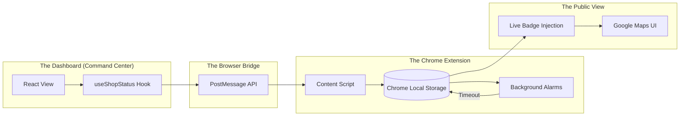

# System Design: ShopSwitch Ecosystem

**Project Objective:** To build a seamless, low-latency link between a store's physical presence and its Google Maps status.

---

## 🏗️ High-Level System Architecture

The ecosystem is designed as a **Bi-Directional Sync Loop**. It doesn't rely on slow server-side updates; instead, it uses the owner's browser as a high-speed relay.

---

## 📋 Component Descriptions

### 1. The React Dashboard (`/src`)
This is the private administrative interface.
- **State Management:** Custom React hooks (`useShopStatus`) handle the transition between states.
- **Security:** It performs a hard check on geolocation before allowing any status change. It also requires a simulated Biometric MFA for "Confirming Intent."
- **Audit:** Every toggle is saved locally (LocalStorage) to keep a history of when the shop was open/closed.

### 2. The Chrome Extension (`/StopSwitch`)
This is the "Bridge" that makes the data visible to the public (or the owner viewing their listing).
- **Background Worker:** Manages the **Auto-Revert** timers. It runs independently of the dashboard tab.
- **Injected Logic:** The extension scouts the Google Maps page for specific HTML elements (Business Name) and injects a custom badge using **Shadow DOM** so it doesn't break Google's page styling.

### 3. The Synchronization Layer (The Handshake)
Since the dashboard and the extension live in different security zones:
- The dashboard "shouts" using `window.postMessage`.
- The extension "listens" for that specific shout.
- Once they connect, they use **Chrome Local Storage** as a shared clipboard to keep the status perfectly in sync across multiple browser tabs.

---

## 🔒 Security Principles
- **Origin Validation:** The project only allows messages from `http://localhost`, ensuring third-party sites can't hack the store status.
- **Non-Persistence:** The extension relies on local storage only, keeping this research prototype self-contained and private.

---
*Project Status: Private Individual Research Phase.*
